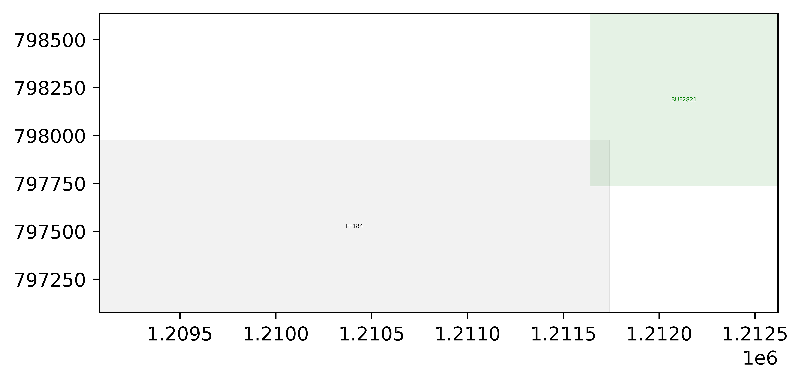

# EDACompetition2024

> 2024 EDA 竞赛赛题 2：时钟树综合（Clock Tree Synthesis, CTS）  
> 获奖情况：全国三等奖

## 项目简介

本项目面向数字后端设计中的时钟树综合问题。程序读取赛题给定的 `constraints.txt` 与 `problem.def`，根据触发器（FF）坐标、芯片边界、缓冲器尺寸、最大扇出等约束，自动插入缓冲器（BUF）并生成符合 DEF 风格格式的 `solution.def`。

项目核心目标是在满足版图边界、扇出约束和组件格式要求的基础上，构建从 `CLK` 到所有 FF 的分层时钟网络，为后续评测程序计算时钟延迟、全局偏斜、RC、重叠面积等指标提供可提交解。

## 核心思路

项目采用“分层聚类 + 缓冲器合法化放置”的方式生成时钟树：

1. 解析输入文件，读取芯片边界、FF/BUF 尺寸、CLK 位置、FF 坐标和赛题约束。
2. 根据 `max_fanout` 计算每层需要的缓冲器数量，保证单个缓冲器连接的子节点数量不超过扇出限制。
3. 对 FF 坐标执行带容量限制的 K-means 聚类，将相近 FF 分到同一簇。
4. 在每个簇的几何中心附近插入 BUF，并通过搜索合法位置避免与已有 FF/BUF 重叠。
5. 对上一层 BUF 继续聚类，逐层向上生成缓冲器网络，直到最终可以连接到时钟源 `CLK`。
6. 按赛题要求写出 `solution.def`，包含组件声明和网络连接关系。

## 项目结构

```text
EDACompetition2024/
|-- README.md
|-- pre.rar
|-- cts_problems/
|   |-- README.txt
|   |-- CheckFormat.py
|   |-- example_problem/
|   `-- problem1/ ... problem10/
`-- myeda_kmean_limit_4/
    `-- Project1/
        |-- Project1.sln
        `-- Project1/
            |-- main.cpp
            |-- readfile.cpp / readfile.h
            |-- writefile.cpp / writefile.h
            |-- total_cluster.cpp / total_cluster.h
            |-- findNonOverlappingPosition.h
            |-- isOverlap.h
            |-- ThreadPool.h
            |-- Makefile
            |-- constraints.txt
            `-- problem.def
```

## 主要模块

| 模块 | 作用 |
| --- | --- |
| `main.cpp` | 程序入口，组织读取输入、聚类建树和输出解文件 |
| `readfile.*` | 解析 `constraints.txt` 和 `problem.def`，提取约束、版图信息和 FF 坐标 |
| `total_cluster.*` | 实现多层 K-means 聚类，并生成分层 BUF 连接关系 |
| `findNonOverlappingPosition.h` | 在簇中心附近搜索不重叠且位于芯片边界内的 BUF 位置 |
| `isOverlap.h` | 判断待放置 BUF 是否与已有组件矩形重叠 |
| `ThreadPool.h` | 为 BUF 合法位置搜索提供多线程任务队列 |
| `writefile.*` | 按赛题格式写出最终 `solution.def` |
| `cts_problems/CheckFormat.py` | 官方格式检查脚本，用于验证 `solution.def` 文件格式 |

## 环境要求

- C++17 或更高版本
- Windows + Visual Studio 2022，或支持 C++17 的 `g++`
- Python 3（用于运行赛题格式检查脚本）

项目中同时保留了 Visual Studio 工程文件和 `Makefile`，可以按自己的环境选择构建方式。

## 编译方式

### 使用 Makefile

```bash
cd myeda_kmean_limit_4/Project1/Project1
make
```

### 使用 Visual Studio

打开：

```text
myeda_kmean_limit_4/Project1/Project1.sln
```

选择 `x64 / Debug` 或合适配置后直接构建运行。

## 运行方式

当前 `main.cpp` 默认读取运行目录下的：

```text
constraints.txt
problem.def
```

并在同目录生成：

```text
solution.def
```

示例流程：

```bash
cd myeda_kmean_limit_4/Project1/Project1
make
cp ../../../cts_problems/problem1/constraints.txt .
cp ../../../cts_problems/problem1/problem.def .
./main
```

在 Windows PowerShell 中可使用：

```powershell
cd myeda_kmean_limit_4\Project1\Project1
Copy-Item ..\..\..\cts_problems\problem1\constraints.txt .
Copy-Item ..\..\..\cts_problems\problem1\problem.def .
.\main.exe
```

如果希望通过命令行参数指定输入文件，可恢复 `main.cpp` 中已经预留的参数读取逻辑，将：

```cpp
myfile.setfilename("constraints.txt", "problem.def");
```

替换为：

```cpp
myfile.setfilename(argv[1], argv[2]);
```

并启用 `argc` 检查。

## 输出文件

程序生成的 `solution.def` 主要包含两部分：

- `COMPONENTS`：原始 FF 与新增 BUF 的位置声明。
- `NETS`：BUF 与 FF、BUF 与 BUF、CLK 与顶层 BUF 的网络连接关系。

可使用官方格式检查脚本验证输出格式：

```bash
python ../../../cts_problems/CheckFormat.py .
```

## 示例评测结果

仓库中 `cts_problems/problem1/report.txt` 保存了一次示例提交的评测结果：

```text
Clock Global Skew: 5905.576 ps
Average clock latency: 1364.8952 ps
Buffer Count: 3931
Out of Floorplan Inst Number: 0
Max RC: 53244159.83/44.6569 ohm*pf
Max Fanout: 0/65 (0.0%)
Overlap Inst Number: 3036, Area: 992350029/3467142000 nm*nm (28.62%)
```

示例重叠检测可视化：



## 特点与优化方向

项目当前实现的重点是快速生成满足扇出和基础格式要求的分层 CTS 方案，具备以下特点：

- 用多层聚类降低大规模 FF 点集的建树复杂度。
- 按 `max_fanout - 1` 控制每个 BUF 的直接连接规模。
- 通过逐步扩大搜索半径寻找合法 BUF 位置。
- 使用线程池并行检查候选位置，提高搜索效率。
- 输出格式贴合赛题 `solution.def` 要求，便于接入官方检查脚本。

后续可继续改进的方向：

- 将聚类距离函数改为更严格的曼哈顿距离或欧氏距离。
- 在聚类目标中加入 RC、延迟和全局偏斜估计。
- 引入更强的 overlap legalization 策略，降低重叠面积。
- 固定随机种子或支持外部 seed，提升结果可复现性。
- 完善命令行参数，支持批量运行不同 problem case。

## 竞赛数据说明

`cts_problems/` 中包含官方示例、随机样例和多个测试 case：

- `example_problem/`：官方文档中的示例问题。
- `problem1/`：包含一份随机生成的提交结果与评测报告。
- `problem2` 至 `problem10/`：供本地测试使用的 case。
- `CheckFormat.py`：用于检查提交文件格式，格式不合格的解不会进入后续评分。

最终评测以竞赛服务器上的测试数据和评分程序为准。
